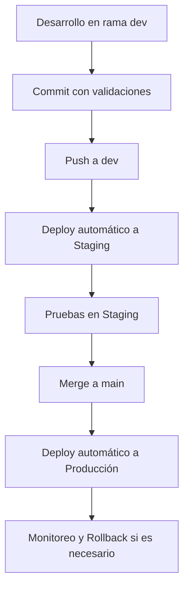

# 🚀 Guía de Deploy para ModularQ

## 📋 Resumen del Flujo

Tu proyecto ahora tiene un flujo de deploy robusto que te garantiza que cuando hagas merge a `main`, el deploy funcionará correctamente.

### 🔄 Flujo de Trabajo



## 🛠️ Configuración Inicial

### 1. **Secrets de GitHub**

Ve a `Settings > Secrets and variables > Actions` y agrega:

#### Para Staging:
- `STAGING_SUPABASE_URL`
- `STAGING_SUPABASE_ANON_KEY`
- `STAGING_SUPABASE_SERVICE_ROLE_KEY`
- `STAGING_URL`

#### Para Producción:
- `PROD_SUPABASE_URL`
- `PROD_SUPABASE_ANON_KEY`
- `PROD_SUPABASE_SERVICE_ROLE_KEY`
- `PROD_URL`

#### Para Vercel:
- `VERCEL_TOKEN`
- `VERCEL_ORG_ID`
- `VERCEL_PROJECT_ID`

### 2. **Environments de GitHub**

Ve a `Settings > Environments` y crea:

- **staging**: Deploy automático desde `dev`
- **production**: Deploy manual desde `main` (con protección)

### 3. **Configuración de Vercel**

1. Conecta tu repositorio con Vercel
2. Configura las variables de entorno para cada proyecto
3. Configura los dominios:
   - Staging: `modularq-staging.vercel.app`
   - Producción: `modularq.vercel.app`

## 🔍 Validaciones Automáticas

### Pre-commit Hooks
Antes de cada commit se ejecutan:
- ✅ TypeScript type checking
- ✅ ESLint
- ✅ Tests unitarios
- ✅ Build test
- ✅ Verificación de secrets

### CI/CD Pipeline
En cada push se ejecutan:
- ✅ Todas las validaciones de pre-commit
- ✅ Tests E2E
- ✅ Build para el entorno correspondiente
- ✅ Deploy automático (staging) o manual (producción)

## 📝 Comandos Útiles

### Desarrollo Local
```bash
# Desarrollo normal
pnpm dev

# Desarrollo con variables de staging
pnpm dev:neon

# Validar antes de commit
git add .
git commit -m "feat: nueva funcionalidad"

# Validar antes de deploy
./scripts/validate-pre-deploy.sh
```

### Deploy Manual
```bash
# Deploy a staging (desde dev)
git push origin dev

# Deploy a producción (desde main)
git push origin main

# Rollback si es necesario
./scripts/rollback.sh production <commit_hash>
```

## 🚨 Manejo de Errores

### Si el Deploy Falla

1. **Revisa los logs** en GitHub Actions
2. **Identifica el problema** (tests, build, configuración)
3. **Arregla el código** en la rama correspondiente
4. **Haz push nuevamente**

### Si Necesitas Rollback

1. **Identifica el commit estable** anterior
2. **Ejecuta el rollback**:
   ```bash
   ./scripts/rollback.sh production <commit_hash>
   ```
3. **Verifica** que la aplicación funciona
4. **Arregla el problema** en una nueva rama

## 🔒 Mejores Prácticas

### ✅ Hacer Siempre
- Trabajar en la rama `dev`
- Hacer commits pequeños y frecuentes
- Escribir tests para nueva funcionalidad
- Revisar los logs de staging antes de mergear a main
- Mantener `main` siempre estable

### ❌ Evitar
- Hacer commits directamente a `main`
- Saltar las validaciones con `--no-verify`
- Deployar sin probar en staging
- Ignorar errores de CI/CD
- Hacer merge sin revisar

## 📊 Monitoreo

### Health Checks
- Staging: `https://modularq-staging.vercel.app/api/health`
- Producción: `https://modularq.vercel.app/api/health`

### Logs
- GitHub Actions: Ve a la pestaña "Actions" en tu repositorio
- Vercel: Dashboard de Vercel > Functions > Logs

## 🆘 Troubleshooting

### Problema: "Build failed"
**Solución**: Revisa los logs de build, probablemente hay un error de TypeScript o dependencias.

### Problema: "Tests failed"
**Solución**: Ejecuta `pnpm test` localmente y arregla los tests.

### Problema: "Deploy timeout"
**Solución**: Verifica que las variables de entorno estén configuradas correctamente.

### Problema: "Environment not found"
**Solución**: Verifica que los environments estén configurados en GitHub.

## 📞 Soporte

Si tienes problemas con el deploy:

1. **Revisa esta documentación**
2. **Consulta los logs** en GitHub Actions
3. **Verifica la configuración** de secrets y environments
4. **Ejecuta las validaciones** localmente

---

## 🎯 Resumen

Con esta configuración:
- ✅ **Desarrollas** en `dev` con validaciones automáticas
- ✅ **Pruebas** en staging automáticamente
- ✅ **Deployas** a producción con confianza
- ✅ **Rollback** fácil si algo falla
- ✅ **Monitoreo** continuo de la aplicación

**¡Tu flujo de deploy está listo! 🚀**

